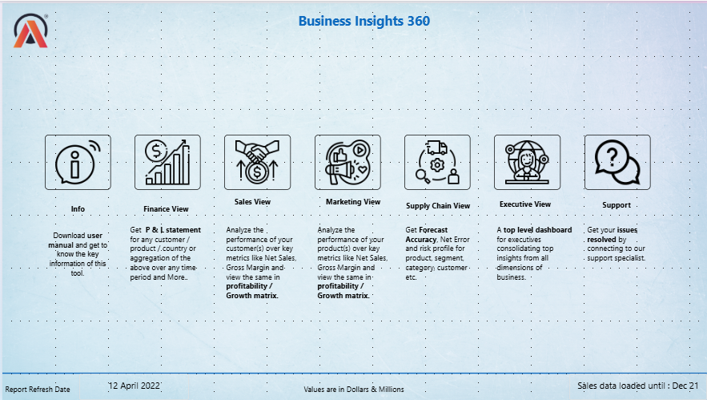
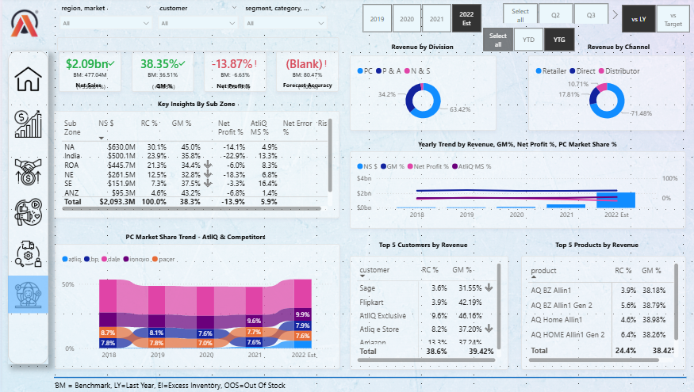
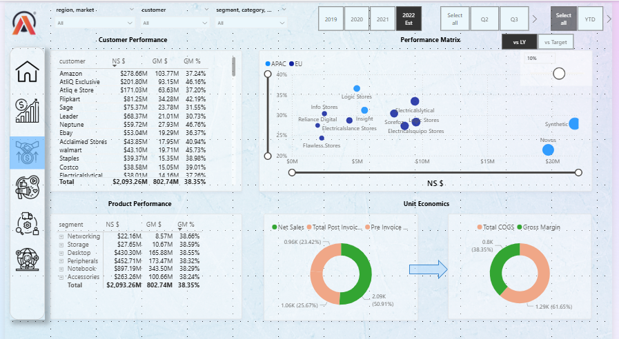
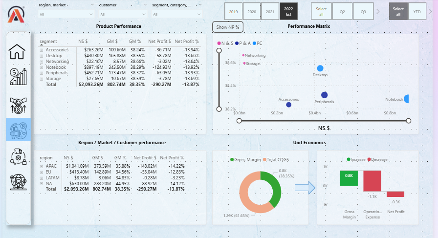
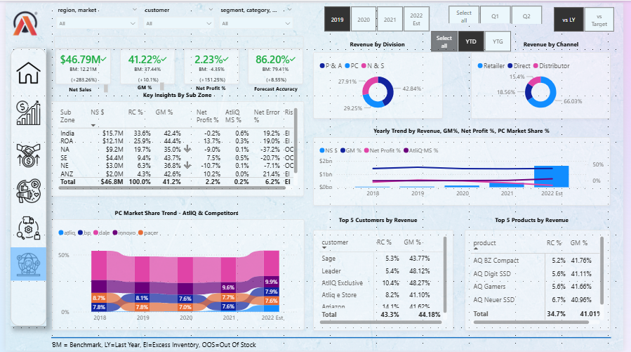

# 📊 Business Performance Analytics Dashboard | Power BI

> An end-to-end Business Intelligence solution built using **Power BI**, **Power Query**, **DAX**, and **Star Schema Data Modeling** to analyze Finance, Sales, Marketing, Supply Chain, and Executive KPIs for AtliQ Hardware.

---

## 📌 Project Overview

Businesses generate massive amounts of transactional data every day, but without proper analytics, transforming that data into actionable insights becomes challenging.

This project focuses on designing and developing an interactive Power BI dashboard for **AtliQ Hardware**, enabling stakeholders to monitor business performance across Finance, Sales, Marketing, Supply Chain, and Executive functions through a centralized reporting solution.

The dashboard empowers decision-makers with real-time KPIs, trend analysis, profitability insights, customer and product performance, forecast accuracy, and regional comparisons.

---

# 🎯 Business Problem

AtliQ Hardware operates across multiple regions and product categories, generating large volumes of sales, finance, marketing, and supply chain data. However, stakeholders lacked a centralized reporting system to effectively monitor business performance and make timely, data-driven decisions.

The objective of this project was to design an interactive Power BI dashboard that consolidates business data into meaningful insights, enabling executives to evaluate KPIs, identify performance trends, and improve strategic decision-making.

---

# 📌 Project Objectives

- Build an interactive and user-friendly Power BI dashboard.
- Monitor Finance, Sales, Marketing, Supply Chain, and Executive KPIs.
- Analyze profitability, revenue, and gross margin performance.
- Compare regional and market performance across different time periods.
- Track customer and product performance.
- Evaluate forecast accuracy and net error metrics.
- Enable stakeholders to make faster, data-driven business decisions.

---

# 🛠️ Tools & Technologies Used

| Category | Technologies |
|----------|--------------|
| 📊 Data Visualization | Power BI Desktop |
| 🔄 Data Transformation | Power Query |
| 📈 Data Modeling | Star Schema |
| 🧮 Calculations | DAX (Data Analysis Expressions) |
| 🗃️ Data Source | Excel / CSV |
| 🏢 Domain | Sales, Finance, Marketing, Supply Chain |
| 🎨 UI Design | Bookmarks, Buttons, Slicers, KPI Cards |
| 🚀 Deployment | Power BI Service |

---

## 📁 Data Modeling Approach

A well-structured **Star Schema** data model was implemented to ensure efficient querying, optimized performance, and accurate business reporting.

### Data Model Highlights

- Developed a **Star Schema** with fact and dimension tables.
- Established relationships between Sales, Customers, Products, Markets, and Dates.
- Built reusable DAX measures for KPI calculations.
- Optimized the model for fast filtering and aggregations.
- Enabled scalable reporting across multiple business functions.

---

## 🗂️ Data Model

  

> **Figure:** Star Schema used in the Power BI solution.

---

# 📸 Dashboard Showcase
---

## 🏠 Home Page

The Home Page acts as the navigation hub of the report. Users can access Finance, Sales, Marketing, Supply Chain, and Executive dashboards through interactive buttons.

  

### Key Features

- Central navigation page for all business views.
- Interactive buttons for seamless page navigation.
- Modern dashboard layout with KPI-focused design.
- Consistent user experience across all report pages.

- ---

## 💰 Finance Dashboard

The Finance Dashboard provides a comprehensive view of the organization's financial performance. It enables stakeholders to monitor Profit & Loss, Gross Margin, Net Sales, and key financial KPIs across different time periods and business dimensions.

  

### Key Features

- Analyze Revenue, Net Sales, and Gross Margin.
- Track Profit & Loss performance over time.
- Compare Year-to-Date (YTD) and Year-over-Year (YoY) metrics.
- Filter insights by customer, product, region, and fiscal year.
- Identify high and low-performing business segments.

---

## 📈 Sales Dashboard

The Sales Dashboard helps monitor sales performance across customers, products, and markets. It provides valuable insights into revenue trends, customer contribution, and product-level performance to support sales strategy and decision-making.

  

### Key Features

- Monitor customer and product sales performance.
- Analyze sales trends across different markets.
- Identify top-performing and underperforming products.
- Compare revenue across multiple time periods.
- Interactive filtering using slicers and drill-down capabilities.

---

## 📢 Marketing Dashboard

The Marketing Dashboard provides insights into product performance, market trends, and profitability across different regions. It helps business teams evaluate marketing effectiveness and identify opportunities for growth.

  

### Key Features

- Analyze market-wise revenue and profitability.
- Compare product performance across regions.
- Identify high-growth and low-performing markets.
- Monitor Gross Margin % and Net Profit %.
- Interactive filtering using fiscal year, market, and product slicers.

---

## 🚚 Supply Chain Dashboard

The Supply Chain Dashboard monitors forecast accuracy, inventory performance, and supply chain efficiency. It enables stakeholders to identify forecast deviations and improve operational planning.

  

### Key Features

- Track Forecast Accuracy and Net Error.
- Analyze Absolute Error and Forecast Variance.
- Compare forecast performance across customers and products.
- Identify high-risk products and markets.
- Support data-driven supply chain planning.

---

## 👔 Executive Dashboard

The Executive Dashboard provides a high-level overview of key business KPIs across Finance, Sales, Marketing, and Supply Chain. It enables leadership teams to monitor overall business health and make strategic decisions quickly.

  

### Key Features

- Executive summary of key business KPIs.
- Consolidated view across all business functions.
- Revenue, Profit, Gross Margin, and Forecast KPIs.
- Business performance comparison across regions and markets.
- Interactive dashboard for strategic decision-making.

---

# 📈 Key Business Insights

The dashboard enables stakeholders to gain valuable business insights across multiple functional areas:

- Identify top-performing and underperforming products.
- Compare sales and profitability across different regions and markets.
- Monitor Gross Margin, Net Profit, and Revenue trends over time.
- Evaluate customer performance and revenue contribution.
- Track Forecast Accuracy and Net Error for supply chain planning.
- Analyze KPIs using interactive filters for fiscal years, markets, products, and customers.
- Support faster, data-driven decision-making with centralized reporting.

---

# 🧮 DAX Measures Used

The project utilizes DAX (Data Analysis Expressions) to build dynamic and interactive business metrics.

### Examples of DAX Measures

- Net Sales
- Gross Margin
- Gross Margin %
- Net Profit
- Net Profit %
- Forecast Accuracy %
- Net Error
- Absolute Error
- Revenue Contribution %
- YTD & YTG Calculations
- Year-over-Year (YoY) Growth
- Dynamic KPI Cards
- Dynamic Titles based on Filters

---

# 🎯 Skills Demonstrated

### Business Intelligence

- Dashboard Design
- Business KPI Analysis
- Executive Reporting
- Data Storytelling

### Power BI

- Data Modeling
- Star Schema
- Relationships
- Bookmarks
- Drill-through
- Page Navigation
- Slicers
- KPI Cards

### Power Query

- Data Cleaning
- Data Transformation
- Data Validation
- Data Shaping

### DAX

- Measures
- Calculated Columns
- Time Intelligence
- Aggregations
- Variables
- Filter Context

### Business Domains

- Finance
- Sales
- Marketing
- Supply Chain

---

# 📚 Project Learnings

Through this project, I gained practical experience in:

- Designing enterprise-level Power BI dashboards.
- Building scalable Star Schema data models.
- Writing efficient DAX measures.
- Transforming raw data using Power Query.
- Creating interactive navigation using bookmarks and buttons.
- Applying business intelligence concepts to solve real-world problems.
- Developing dashboards focused on usability and executive reporting.

---

# 👩‍💻 About Me

I'm **Tanvi Badmanji**, a Financial Analyst with an MBA in Finance and a strong interest in Business Intelligence, Data Analytics, and Power BI.

This project demonstrates my ability to transform business data into meaningful insights through interactive dashboards, data modeling, and DAX.

### Connect with Me

- 📧 **Email:** tanvibadmanji@gmail.com
- 💼 **LinkedIn:** [Tanvi Badmanji](https://www.linkedin.com/in/tanvi-badmanji/)
- 💻 **GitHub:** [tanvibadmanji](https://github.com/tanvibadmanji)
